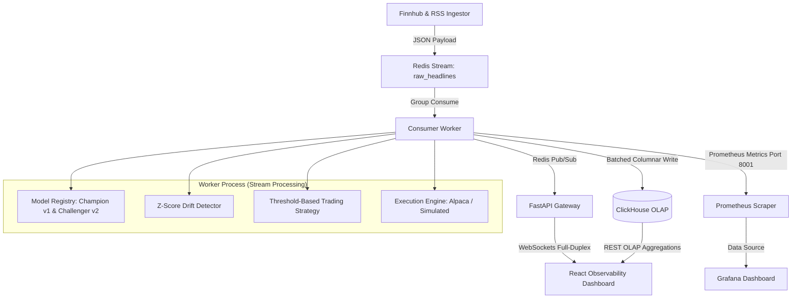

# SentiStream 🚀

**SentiStream** is a real-time, event-driven MLOps sentiment analytics and quantitative paper trading pipeline for financial headlines. It demonstrates high-performance data engineering, machine learning service deployment, and real-time observability.

The system processes financial news feeds through an event queue, routes them deterministically to dual ONNX FinBERT models, checks for statistical sentiment drift, and executes quantitative trading strategies (Long-Only or Long-Short/Short-Selling) on simulated or live Alpaca brokerage sandboxes.

---

## 💎 Core Features

### 1. Event-Driven Real-time Pipeline
* **Async News Ingestor (`ingestor.py`)**: Polls Finnhub's financial news API with token-bucket rate limiting and falls back automatically to financial RSS feeds (Google News, Yahoo Finance) on API rate limits or failures. Implements SHA-256 deduplication to prevent duplicate processing.
* **Broker Queue (Redis Streams)**: Buffers raw ingest payloads in the `raw_headlines` stream to decouple ingestion from inference.
* **Consumer Worker (`worker.py`)**: Consumes the stream, routes text to versioned INT8-quantized FinBERT ONNX models, updates Z-score drift stats, evaluates trading signals, executes simulated/Alpaca trades, and persists results.

### 2. Dual ONNX Model Registry & A/B Testing
* Concurrently runs **Champion (`v1`)** and **Challenger (`v2`)** INT8-quantized FinBERT models locally via CPU execution threads.
* Implements a deterministic **80/20 A/B split** based on the headline UUID's hash modulo:
  `Model Version = v1 if int(headline_id[:8], 16) % 10 < 8 else v2`
  This ensures stable model assignment across worker restarts and Dead Letter Queue (DLQ) replays.
* Exposes detailed evaluation counts, average latencies, and p50, p95, and p99 percentile distributions grouped by model version.

### 3. Quantitative Trading Strategies
* **Strategy Modes**: Supports **Long-Only** and **Long-Short (Short Selling)** strategy modes, toggled dynamically from the UI.
* **Long-Only Mode**:
  * **Confidently Positive** (sentiment score $\ge 0.75$): Buy an allocation equal to 5% of net portfolio value.
  * **Confidently Negative** (sentiment score $\ge 0.75$): Sell/liquidate the entire ticker position (no shorting).
* **Long-Short Mode**:
  * **Confidently Positive**: Cover any existing short position completely. If flat or long, add to/open a long position (5% allocation cost).
  * **Confidently Negative**: Liquidate any existing long position completely. If flat or short, open/scale into a short position (5% allocation proceeds added to cash, shares become negative).
* **Cooldown limit**: Enforces a strict 60-second cooldown period per ticker.
* **Simulated & Alpaca Engines**: Supports local **Simulated Engine** for offline development or live orders via **Alpaca Brokerage Sandbox**.
* **Capital-Depletion Validation**: Dispatches WebSocket notifications for out-of-cash errors.

### 4. Pure Ledger Valuation & Replay
* Reconstructs the portfolio cash, position ledger, realized/unrealized P&L, and win-rate metrics directly from ClickHouse trade history using `PortfolioService`.
* Handles short sale proceeds (added to cash at execution time) and short covering costs (subtracted from cash) without double-counting position liabilities.

### 5. MLOps Telemetry (Prometheus & Grafana)
* Tracks tokenization/inference latency histograms, processed throughput count, rolling Z-score sentiment drift, portfolio cash/valuation, and stream backlogs.
* Starts a background Prometheus metrics server on port `8001` inside the worker process, avoiding external gateway dependencies.
* Integrates a pre-configured Grafana dashboard utilizing Prometheus metrics out-of-the-box.

### 6. Premium Glassmorphic Web UI
* Displays live ticker news streams with distinct, version-specific badges (`V1` / `V2`) indicating which model performed inference.
* Features a responsive, side-by-side **Model A/B Performance** card comparing evaluations, average latencies, and percentiles.
* Formats negative position shares as `SHORT` (e.g., `10 SHORT`) with distinct amber accents (`var(--color-drift)`) to represent short liabilities.
* Displays a header panel containing Net Portfolio Value, Cash Balance, Realized P&L, Unrealized P&L, and Win-Rate metrics using beautiful, custom telemetry cards and inline SVGs.

---

## 🚀 Pipeline Architecture



---

## 🛠️ Local Installation & Setup

### Prerequisites
* Python 3.11+
* Node.js 20+
* Docker & Docker Compose (for ClickHouse, Redis, Prometheus, and Grafana)

### 1. Start Docker Services
```bash
docker-compose up -d
```
This boots:
* **Redis** (Port `6379`)
* **ClickHouse** (Port `9000` & HTTP `8123`)
* **Prometheus** (Port `9090`)
* **Grafana** (Port `3000`)

### 2. Configure Environment
Create a `.env` file in the root directory:
```env
REDIS_URL=redis://localhost:6379
CLICKHOUSE_HOST=localhost
CLICKHOUSE_PORT=9000
CLICKHOUSE_DATABASE=default
CLICKHOUSE_USER=default
CLICKHOUSE_PASSWORD=

# Portfolio Setup
INITIAL_PORTFOLIO_CAPITAL=100000.0
TRADING_ENGINE=simulated # 'simulated' or 'alpaca'

# (Optional) Alpaca credentials
ALPACA_API_KEY=your_alpaca_key
ALPACA_SECRET_KEY=your_alpaca_secret
ALPACA_PAPER_BASE_URL=https://paper-api.alpaca.markets

# (Optional) Finnhub News key
FINNHUB_API_KEY=your_finnhub_key
```

### 3. Setup Virtual Environment & Dependencies
```bash
python3 -m venv venv
source venv/bin/activate
pip install -r backend/requirements.txt
```

### 4. Initialize Models
Populate the model directory with ONNX assets:
```bash
python backend/app/model.py
```
*(If version files are missing, SentiStream automatically initializes `models/finbert-int8-v1.onnx` and `models/finbert-int8-v2.onnx` by copying the base quantized asset).*

### 5. Launch Backend Daemons
In separate terminal tabs (with virtualenv activated):

* **API Gateway**:
  ```bash
  PYTHONPATH=backend ./venv/bin/uvicorn app.main:app --host 0.0.0.0 --port 8000 --reload
  ```
* **Consumer Worker**:
  ```bash
  PYTHONPATH=backend ./venv/bin/python backend/app/worker.py
  ```
* **News Ingestor**:
  ```bash
  PYTHONPATH=backend ./venv/bin/python backend/app/ingestor.py
  ```

### 6. Start Frontend Development Server
```bash
cd frontend
npm install
npm run dev
```
Open `http://localhost:5173` to view the live dashboard!

---

## 🧪 Testing & Seeding Guide

### 1. Run Unit & Integration Tests
Executes Pytest suites covering trading, strategy cooldowns, drift alert algorithms, and database ledger replaying:
```bash
PYTHONPATH=backend ./venv/bin/pytest
```

### 2. Seed Mock Transactions & Headlines
Injects real-time financial headlines into Redis to test pipeline execution and trigger strategy trades:
```bash
PYTHONPATH=backend ./venv/bin/python scripts/seed_test_data.py --mode=trades
```

### 3. E2E Browser Testing (Playwright)
Validates frontend components, WebSocket streaming updates, capital warning banners, and reconnection resiliency:
```bash
cd frontend
npx playwright test
```

### 4. Load Testing (Locust)
Simulates concurrent stream writes and high API endpoint query load:
```bash
./venv/bin/locust -f backend/tests/locustfile.py --headless -u 10 -r 2 --run-time 5m --host http://localhost:8000
```

---

## 📐 Architectural Decisions (ADRs)

For a detailed design log, refer to [DECISIONS.md](file:///Users/rutuja/Desktop/SentiStream/DECISIONS.md):
1. **Process-Local Price Feed Singletons**: Avoids shared memory/DB lookups for live quotes. Each backend process uses an independent 30s cache.
2. **Lightweight HTTP Server for Worker Telemetry**: Starts a Prometheus exporter on port `8001` in the worker process thread, removing Pushgateway dependencies.
3. **Bypassing `/metrics` tracking**: Excludes scraping routes from Gateway request middleware to avoid skewing real-user traffic metrics.
4. **Z-Score Resetting Rules**: Quiet tickers (no headlines for 60s) reset their sentiment rolling standard-deviation metrics to `0.0` to avoid stale indicators.
5. **Dual ONNX Startup Sessions**: Pre-loads both v1 and v2 models in memory (~210MB footprint) to achieve stable, sub-50ms p99 latency benchmarks from the first request.
6. **Position Sizing and Scaling**: Allows consecutive buys/sells up to cash limits once the cooldown expires, rather than enforcing a flat-to-active rule.
7. **Short-Covering Liquidation Symmetry**: Covers short positions (or liquidates long positions) completely when opposing sentiment triggers occur to mitigate risk.
